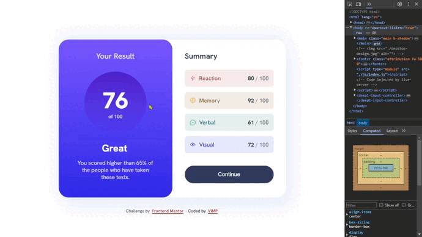

# Frontend Mentor - Results summary component solution



This is a solution to the [Results summary component challenge on Frontend Mentor](https://www.frontendmentor.io/challenges/results-summary-component-CE_K6s0maV).

Frontend Mentor challenges help you improve your coding skills by building realistic projects.

🔳 [The challenge](#the-challenge-nerd_face)

🔳 [Screenshots](#screenshots-camera)

🔳 [Links](#links-link)

🔳 [Built with](#built-with-hammer_and_pick)

🔳 [What I learned](#what-i-learned-nerd_face)

🔳 [Author](#author-beginner)

## *The challenge* :nerd_face:

Users should be able to:

🎯 View the optimal layout for the interface depending on their device's screen size.

🎯 See hover and focus states for all interactive elements on the page.

🎯 **Bonus**: Use the local JSON data to dynamically populate the content.

## *Screenshots* :camera:


## *Links* :link:

[Live Site URL](https://mendezpvi.github.io/fm-results-summary-component/) 👀

[Solution in Frontend Mentor](https://www.frontendmentor.io/solutions/results-summary-component--4P_YkUVNh) 👀

[Challenges overcome](https://github.com/mendezpvi/frontend-mentor-challenges) 👀

## *Built with* :hammer_and_pick:

✅ Semantic HTML5 markup

✅ CSS custom properties

✅ Utility classes

✅ Flexbox

✅ CSS Grid

✅ Mobile-first workflow

## *What I learned* :nerd_face:

💠 `import`, `export`
```js
export const data = [ ... ]

// *********************************

import { data } from '/data.js'
```

💠 Template literals  
💠 for of
```js
function renderData(data) {
  let items = ""
  for (let item of data) {
    items += `
      <li>
      // CODE
      </li>
    `
  }
}
```

💠 `.innerHTML`
```js
summaryElements.innerHTML = items
```

💠 `Math.round`
```js
Math.round(average)
```

💠 `mouseenter`, `mouseout`, `focusin`, `focusout`
```js
summaryBtn.addEventListener("mouseenter", function() {
  // CODE
})
```

## *Author* :beginner:

✨ Frontend Mentor - [@mendezpvi](https://www.frontendmentor.io/profile/mendezpvi)
